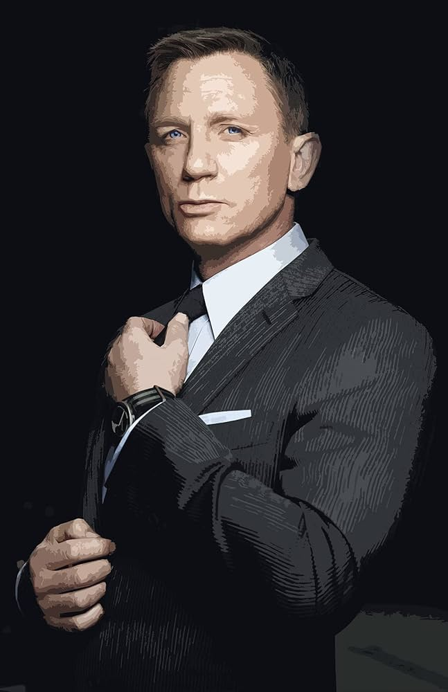

# Джеймс Бонд: Агент 007

**Джеймс Бонд** — легендарный шпион MI6, созданный **Яном Флемингом** в 1953 году. Кодовое имя **007**, лицензия на убийство. Герой 12 романов и 25 фильмов. 

## Краткая биография
- **Происхождение**: Родился в шотландско-швейцарской семье, осиротел в 11 лет.
- **Навыки**: Эксперт в шпионаже, боевых искусствах, обольщении.
- **Любит**: Мартини ("взболтать, не смешивать"), Aston Martin DB5.

## Актеры
1. Шон Коннери (1962–1971, 1983)
2. Джордж Лэзенби (1969)
3. Роджер Мур (1973–1985)
4. Тимоти Далтон (1987–1989)
5. Пирс Броснан (1995–2002)
6. Дэниэл Крейг (2006–2021)

## Фото
  
*Дэниэл Крейг в роли Бонда, "Казино Рояль" (2006)*

> "Меня зовут Бонд. Джеймс Бонд."